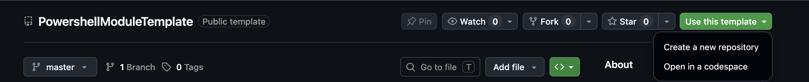

<div align="center">

# 🧰 PowerShell Module Template

**A batteries-included starting point for PowerShell modules.**

Build with [ModuleBuilder](https://github.com/PoshCode/ModuleBuilder), test with Pester,
lint with PSScriptAnalyzer, and ship to the PowerShell Gallery from a git tag.

[](https://github.com/ArchitektApx/PowershellModuleTemplate/actions/workflows/ci.yml)
[](LICENSE)
[](#-target-platforms)
[](#-target-platforms)

</div>

---

## ✨ Features

|  | |
|---|---|
| 🏗️ **ModuleBuilder** | Builds your module from source into a clean, versioned `Dist` output |
| 🧪 **Pester 5** | Test runner wired to `Tests/`, running against the **built** module |
| 🔍 **PSScriptAnalyzer** | Style and correctness pass, plus a compatibility pass against your target hosts |
| 📊 **Code coverage** | Per-command coverage report with an optional minimum-percentage gate |
| 🎯 **Task runner** | One entry point (`tasks.ps1`) for every tool |
| 🤖 **GitHub Actions** | CI matrix across your target hosts, plus a tag-driven Gallery release |
| 🧩 **Platform presets** | `PowerShell5.1`, `PowerShell7`, or both. One key sets the manifest, the lint targets, and the CI matrix |
| 🪄 **`prepare` task** | Renames and stamps the whole template from a single `module.psd1` |
| 🔐 **Hardening guide** | The GitHub rulesets and settings that make publishing to the Gallery safe |
| 📁 **Structured source** | `Source/` layout with `Enum`, `Classes`, `Private`, and `Public` |

---

## 🚀 Quick Start

### 1️⃣ Create your repository

<details open>
<summary><b>Use as a template</b> (recommended)</summary>

<br>

`Use this template > Create a new repository`



</details>

<details>
<summary><b>Or clone it</b></summary>

<br>

```powershell
git clone https://github.com/ArchitektApx/PowershellModuleTemplate
cd PowershellModuleTemplate
```

</details>

### 2️⃣ Configure your module

Edit **`module.psd1`** at the repository root:

| Property | Description |
|----------|-------------|
| `ModuleName` | Your module name (no spaces, must start with a letter) |
| `ModuleDescription` | Short description of the module |
| `ModuleTargetPlatform` | Which PowerShell hosts you target. See [Target platforms](#-target-platforms) |
| `ModuleAuthor` | Your name or team |
| `ModuleCompanyName` | Company or vendor. Also becomes the `LICENSE` copyright holder |
| `ModuleProjectUri` | Your repository URL. Becomes `ProjectUri`/`LicenseUri` and the changelog compare links |
| `ModuleRequiredModules` | Extra **development-time** dependencies, on top of the fixed base set |
| `ModuleRequiredPowershellVersion` | Optional. Pin a higher minimum than the platform default; empty uses the default |

> [!NOTE]
> `CompatiblePSEditions` and `PowerShellVersion` are derived from `ModuleTargetPlatform`,
> so there is no separate key for them.

### 3️⃣ Run the prepare task

```powershell
./tasks.ps1 prepare
./tasks.ps1 prepare -Platform PowerShell7   # override the platform for this run
```

This renames `Source/ModuleTemplate.ps[dm]1`, generates a fresh GUID, stamps the manifest,
`build.psd1` and `LICENSE`, generates `Tools/PSScriptAnalyzer.psd1` and the CI matrix for your
target platform, renders a `README.md` and `CHANGELOG.md` for **your** module, deletes the
template-only scaffolding (`res/`, `Tools/templates/`, `Tools/platforms/`), and installs the
dev requirements.

> [!WARNING]
> `prepare` overwrites `README.md`, `CHANGELOG.md`, `Tools/PSScriptAnalyzer.psd1` and
> `.github/workflows/ci.yml`. Run it on a fresh clone, before you have written anything of
> your own.

### 4️⃣ Write and verify

Add one `.ps1` per function under `Source/Public` (exported) or `Source/Private` (internal),
then:

```powershell
./tasks.ps1 build
./tasks.ps1 test
./tasks.ps1 lint
```

The built module lands in **`Dist/<ModuleName>/<ModuleVersion>`**. 🎉

---

## 🖥️ Target platforms

`ModuleTargetPlatform` selects one of the presets in `Tools/platforms/`:

| Preset | Manifest | Lint targets | CI hosts |
|---|---|---|---|
| 🪟 `PowerShell5.1` | `Desktop`, 5.1.0 | 5.1 | win / WinPS 5.1 |
| 🌍 `PowerShell7` | `Core`, 7.0.0 | 7.0 | win, linux, macos / pwsh 7 |
| 🔀 `PowerShell5.1And7` | `Core, Desktop`, 5.1.0 | 5.1 + 7.0 | all four **(default)** |

The lint step enforces the preset. A ternary or `??` in `Source/` passes under `PowerShell7`
and fails under `PowerShell5.1And7`.

> [!TIP]
> Retargeting after `prepare` means editing `Tools/PSScriptAnalyzer.psd1` and the `ci.yml`
> matrix by hand, since `Tools/platforms/` is gone by then.

---

## 📂 Project Structure

See [ModuleBuilder](https://github.com/PoshCode/ModuleBuilder) for how the source tree is
assembled into the built module.

```text
.
├── 📄 module.psd1          # Module metadata consumed by the tooling
├── 📄 build.psd1           # ModuleBuilder build config (manifest path, output, SemVer)
├── 🎯 tasks.ps1            # Task runner
├── 📁 Source/
│   ├── ModuleTemplate.psd1   # Becomes <YourModuleName>.psd1 after prepare
│   ├── ModuleTemplate.psm1   # Becomes <YourModuleName>.psm1 after prepare
│   ├── Enum/
│   ├── Classes/
│   ├── Private/
│   └── Public/
├── 🧪 Tests/
│   ├── _TestHelpers.ps1      # Imports the BUILT module; no module name hardcoded
│   └── Module.Tests.ps1      # Example suite, green on a fresh clone
├── 🔧 Tools/
│   ├── platforms/          # Target-platform presets (removed by prepare)
│   ├── templates/          # Skeletons rendered by prepare (removed by prepare)
│   └── ...                 # See Tools/README.md
├── 🔐 Docs/HARDENING.md    # GitHub settings to set before publishing (survives prepare)
├── 🤖 .github/workflows/   # ci.yml (matrix from the platform) and release.yml (tag -> PSGallery)
└── 📦 Dist/                # Build output (gitignored, created by build)
```

---

## 🎛️ Tasks Reference

```powershell
./tasks.ps1 <TaskName>
```

| | Task | Description |
|---|------|-------------|
| 🪄 | **prepare** | One-time template setup. Run once, after editing `module.psd1`. `-Platform <name>` overrides `ModuleTargetPlatform`. |
| 🧹 | **cleanup** | One-time teardown. Deletes `prepare.ps1` and itself and strips both tasks out of `tasks.ps1`. Run once the repo is prepared and hardened. |
| 📥 | **install_dev_requirements** | Installs ModuleBuilder, Configuration, Pester 5+, PSScriptAnalyzer, plus your extras. Once per host **per PowerShell edition**. |
| 🏗️ | **build** | Clears `Dist/`, builds with ModuleBuilder into `Dist/<ModuleName>/<ModuleVersion>`. |
| 🧪 | **test** | Runs the Pester suite against the built module. Fails on an empty run. |
| 🔍 | **lint** | PSScriptAnalyzer over `Source/`: style and correctness, then compatibility against your target platform. |
| 📊 | **coverage** | Coverage report over the built module. `-MinimumPercent 90` to gate. |
| 🚢 | **prepare_release** | `./tasks.ps1 prepare_release 1.1.0`. Gates, promotes the changelog, stamps the version, rebuilds, verifies. |

📖 Full tool reference: **[Tools/README.md](Tools/README.md)**

---

## 🤖 CI and Releases

**`ci.yml`** runs lint, build, and test on every push and pull request. Which hosts it runs on
comes from your `ModuleTargetPlatform`; the template's own default is all four (Windows
PowerShell 5.1, and pwsh 7 on Windows, Linux, and macOS).

**`release.yml`** fires on a `vX.Y.Z` tag. It requires the tagged commit to be on the default
branch, requires the tag to match the built manifest version, runs the full CI matrix, then
publishes to the PowerShell Gallery and creates a GitHub release whose body is that version's
`CHANGELOG.md` section.

The release flow after `prepare_release` has stamped the version and the PR is merged:

```bash
git checkout master
git pull origin master
git tag v1.1.0
git push origin v1.1.0
```

The generated module README documents this in full. Pull first: the tag has to land on the
merged commit, not on whatever you had locally.

> [!IMPORTANT]
> Publishing needs a repository secret **`PSGALLERY_API_KEY`**. The workflow also refuses to
> release while `module.psd1` still names the module `ModuleTemplate`.

---

## 🔐 Hardening the repository

> [!CAUTION]
> The release workflow publishes to the PowerShell Gallery, where a version number can never
> be reused and consumers install without reviewing what they get. That makes push access to
> your default branch equivalent to push access to everyone's machines.

**[Docs/HARDENING.md](Docs/HARDENING.md)** covers how to close that path:

🔑 the publishing secret &nbsp;•&nbsp; 🛡️ a default-branch ruleset with an empty bypass list
&nbsp;•&nbsp; 🏷️ immutable release tags &nbsp;•&nbsp; 🤖 read-only Actions permissions
&nbsp;•&nbsp; 🔎 secret scanning with push protection &nbsp;•&nbsp; ✍️ commit signing

Each step says what it does and why it matters, and most come with a `gh` command.

None of it is on by default, and none of it survives "Use this template". It is GitHub
configuration rather than repository content, so you have to redo it per repo. Do it before
the first tag.

---

## 📦 Build Output

- 🔢 Version is controlled in **`build.psd1`** via the `SemVer` key, which `prepare_release`
  stamps for you.
- 📤 Copy `Dist/<ModuleName>/<ModuleVersion>` to a module path, or let the release workflow
  publish it.

---

## 📜 License

[MIT](LICENSE). See the [LICENSE](LICENSE) file in this repository.
